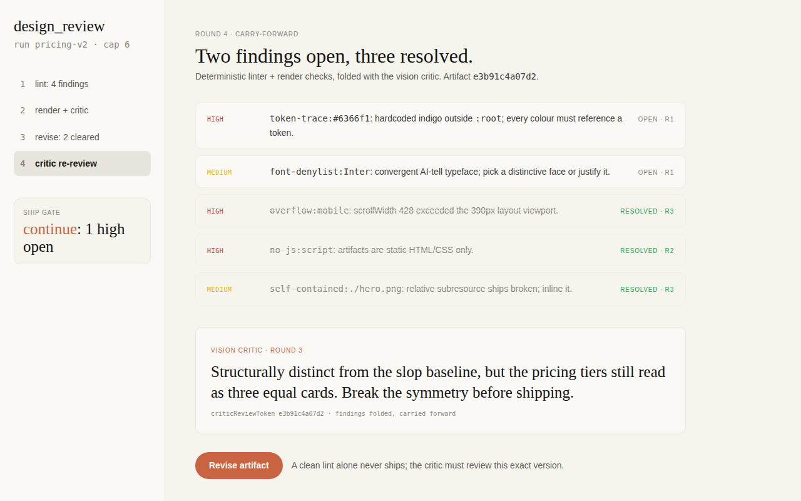
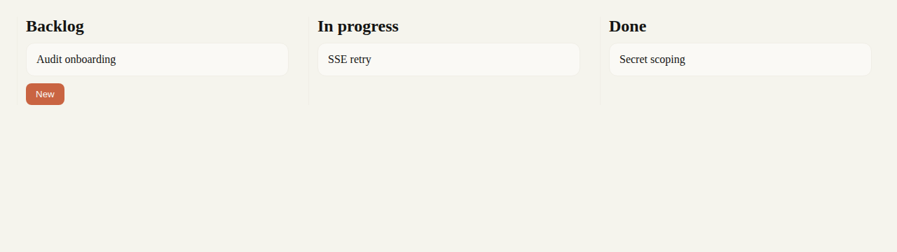

# design-artifact-loop

Render-grounded, non-slop UI design artifacts for coding agents. A skill plus a `design_review` MCP tool, packaged as a native plugin for both **Claude Code** and **Codex CLI**.

<p align="center">
  
  <br>
  <sub>An artifact produced with the loop, reviewing another artifact. It lints clean through its own tool.</sub>
</p>

   

## The problem

Ask a model to "design a dashboard" and you get the statistical average of the web: a gradient hero, three equal cards, default indigo, Inter everywhere. The model isn't bad at design; it just never committed to a design system, so it regresses to the mean. And when it reviews its own work, it grades the code it remembers writing, not the pixels it produced.

| The slop baseline | With a committed system |
|---|---|
|  |  |

## How the loop fixes it

**Author, then conform, then verify the pixels.**

1. **Commit a design system before any markup.** Pick one of ~18 vendored token systems (Stripe, Vercel, Notion, Arc, Claude, ...) or author a fresh one, and reference every colour and size through `var(--…)` tokens.
2. **Write one self-contained static HTML artifact.** It carries no JavaScript and fetches nothing beyond a declared font CDN.
3. **Iterate against evidence.** The `design_review` tool re-renders the artifact headlessly at 1440×900 and 390×844, runs a deterministic linter (token-trace, no-JS, network lockdown, font denylist, blank/overflow detection), and folds in findings from an independent vision critic that reads the rendered PNG. A disk-backed state machine carries findings across rounds and caps the loop at 6. A clean lint alone never ships: the critic must have reviewed the exact artifact version, enforced with a content-hash review token.

## Install

**Claude Code**

```bash
claude plugin marketplace add davekim917/design-artifact-loop
claude plugin install design-artifact-loop@design-artifact-loop
```

**Codex CLI**

```bash
codex plugin marketplace add davekim917/design-artifact-loop
codex plugin add design-artifact-loop@design-artifact-loop
```

(On Codex versions without the plugin system, `./install-codex.sh` wires the same two pieces by hand: a skill mirror into `~/.agents/skills/` plus `codex mcp add`.)

Then ask for a design: the skill triggers on "design a …", "mock up a …", "make me a UI". Artifacts and review state live under `.design-artifact-loop/<id>/` in your working directory for Claude Code, or `~/design-artifacts/<id>/` for Codex. Override either with `DESIGN_ARTIFACT_LOOP_ROOT`.

## Requirements

- **Node.js ≥ 18** runs the MCP server. It ships as a committed self-contained bundle (`server/dist/index.mjs`), so there is no install step. [Bun](https://bun.sh) is only needed for development.
- **Chromium on `PATH`** (or set `CHROMIUM_BIN`) for headless rendering. Egress during render is blocked at the browser layer with `--host-resolver-rules`: only the declared font CDN resolves, so the artifact under review cannot phone home even if the linter misses a construct.

> **Snap chromium note (Ubuntu):** snap confinement denies chromium access to top-level dot-directories under `$HOME`, which surfaces as `render-blank` findings with 0-byte screenshots. Project-nested paths like `~/myproject/.design-artifact-loop/` work fine; if your loop root must live under a top-level dot-dir, point `CHROMIUM_BIN` at a non-snap chromium.

## What's in the box

- `skills/design-artifact-loop/` is the skill: the loop protocol (`SKILL.md`), ~18 vendored design systems (a `DESIGN.md` + `tokens.css` each; Apache-2.0, see `design-systems/ATTRIBUTION.md`), and good/slop fixture pairs.
- `server/` is the `design_review` tool: linter, renderer, and the round/cap state machine, exposed over stdio. 116 tests.

## Design notes

- The linter is advisory; the render sandbox is the boundary. Regex checks give fast feedback and keep the delivered artifact clean, but egress enforcement lives in chromium's DNS allowlist, so the linter doesn't have to chase every fetch-bearing HTML construct.
- Critic findings can't be faked away. Findings are tied to a content hash of the artifact version the critic actually reviewed. Stale findings are dropped, absent critic findings stay open until a fresh critic pass clears them, and a clean artifact cannot ship until the critic has reviewed that exact version.
- State is disk-atomic (write-temp-then-rename under an advisory lock), so overlapping calls on the same run id cannot corrupt the trace.

## Development

```bash
bun install
bun test server/      # linter, state machine, render classification, corpus integrity
bunx tsc --noEmit     # typecheck
bun run build         # rebuild server/dist/index.mjs after editing server/*.ts (commit it)
```

Extracted from [NanoClaw](https://github.com/qwibitai/nanoclaw), where it ships as a container skill for Claude/Codex/OpenCode agents.

## License

MIT (see `LICENSE`). The vendored design-system corpus is Apache-2.0: see `skills/design-artifact-loop/design-systems/LICENSE` and `ATTRIBUTION.md`.
