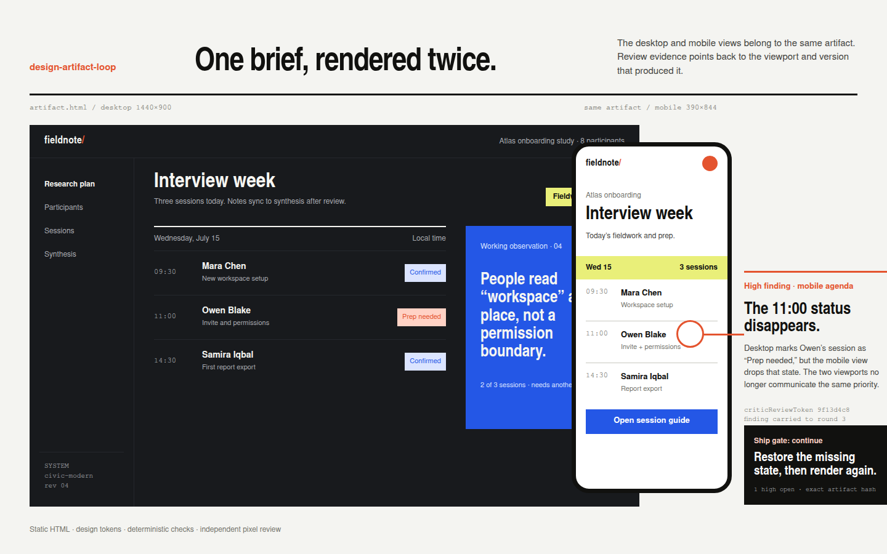
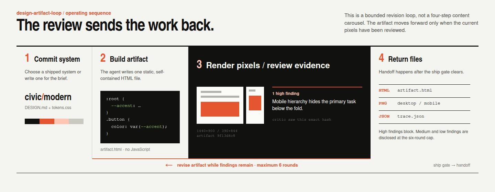

# design-artifact-loop

A Claude Code and Codex plugin that turns a design brief into a reviewed, single-file HTML mockup inside the coding session you already have open.

<p align="center">
  
  <br>
  <sub>One artifact at both viewports, with review evidence attached to the pixels that produced it. Rendered from <code>assets/capabilities.html</code>.</sub>
</p>

  

Before the agent writes markup, it chooses or authors a concrete design system. The plugin renders the result at desktop and mobile sizes, runs deterministic checks, and coordinates a separate vision review of the actual pixels. You receive the HTML, preview images, and review trace.

There is no separate design app or long-running daemon to manage. The MCP server runs over stdio when your coding agent starts it.

## Quick start

### Claude Code

```bash
claude plugin marketplace add davekim917/design-artifact-loop
claude plugin install design-artifact-loop@design-artifact-loop
```

### Codex CLI

```bash
codex plugin marketplace add davekim917/design-artifact-loop
codex plugin add design-artifact-loop@design-artifact-loop
```

Then ask for a design in the same chat where you are working:

> Design a mobile analytics dashboard for an independent record label. Use an editorial system and show the empty, loading, and populated states.

The loop returns:

- `artifact.html`, the self-contained mockup
- desktop and mobile PNGs
- `trace.json`, including findings and the final ship decision

Codex versions without native plugin support can use `./install-codex.sh`. It mirrors the skill into `~/.agents/skills/` and registers the MCP server with `codex mcp add`.

## What happens in the loop

<p align="center">
  
  <br>
  <sub>The source for this diagram lives at <code>assets/workflow.html</code>.</sub>
</p>

The skill owns the workflow. The `design_review` MCP tool handles the repeatable parts: linting, headless rendering, finding history, and the six-round cap.

The MCP server does not contain a vision model. After each render, the skill asks Claude Code or Codex to start a separate critic that reads the PNG and the chosen design system. Those findings are sent back to `design_review` and tied to the exact artifact version with a content hash. A clean lint cannot ship an artifact the critic has not seen.

## What it is for

Design Artifact Loop is for single-screen UI direction: dashboards, landing pages, settings screens, pricing pages, and focused mobile views that can be delivered in chat.

The output is static HTML and CSS. It has no JavaScript and fetches nothing beyond an explicitly declared font CDN. This keeps the artifact portable and makes the review surface small enough to inspect.

It is not a production application builder. If you need routing, application state, backend integration, deployment, or a component refactor in an existing codebase, use the normal implementation workflow after the design direction is approved.

## Why commit a system first?

Without explicit constraints, coding models tend to reuse familiar UI structures: centered gradient heroes, equal cards, default indigo, and the same small group of typefaces. A concrete system gives the agent an actual target instead of asking it to improvise taste one CSS declaration at a time.

The plugin ships 59 design systems. Each pairs a readable `DESIGN.md` with `tokens.css`, and the agent loads only the system selected for the current artifact. You can also author a new system for the brief.

| Uncommitted baseline | With a committed system |
|---|---|
|  |  |

## Review the pixels, not the memory

An agent reviewing its own source can miss what Chromium actually rendered. `design_review` captures the artifact at 1440×900 and 390×844, then combines three kinds of evidence:

- deterministic checks for token use, JavaScript, external resources, and known font defaults
- render checks for blank output and horizontal overflow
- visual findings from a separate critic that reads the PNG

Findings carry across rounds until a reviewed revision clears them. High-severity findings block the ship gate; unresolved medium and low findings are disclosed when the loop reaches its cap.

<p align="center">
  
  <br>
  <sub>A review trace rendered from <code>assets/showcase.html</code>.</sub>
</p>

## Files and state

- `skills/design-artifact-loop/` contains the skill protocol, design systems, and fixture pairs.
- `server/` contains the `design_review` MCP tool, renderer, linter, and state machine.
- `assets/` contains the README visuals and their HTML sources.

Claude Code normally stores a run under `.design-artifact-loop/<id>/` in the current project. Codex installations launched from the plugin directory fall back to `~/design-artifacts/<id>/` so Snap Chromium can read the files. Set `DESIGN_ARTIFACT_LOOP_ROOT` to use another location.

## Requirements

- Node.js 18 or newer runs the committed MCP bundle at `server/dist/index.mjs`. No package install is needed at runtime.
- Chromium must be on `PATH`, or its path must be supplied through `CHROMIUM_BIN`.
- Bun is only required for development.

The renderer blocks network egress with Chromium host-resolution rules. Only the declared Google Fonts hosts resolve during capture; the deterministic network checks provide faster, more specific feedback before rendering.

<details>
<summary>Ubuntu Snap Chromium</summary>

Snap confinement cannot read a top-level hidden directory under `$HOME`. If Chromium produces a zero-byte screenshot, keep the loop inside a project directory or set `CHROMIUM_BIN` to a non-Snap Chromium build. The Codex fallback directory, `~/design-artifacts/`, is intentionally not hidden.

</details>

## Development

```bash
bun install
bun test server/
bunx tsc --noEmit
bun run build         # rebuild and commit server/dist/index.mjs after server/*.ts changes
```

The corpus tests keep `design-systems/index.md`, the shipped directories, attribution, and the expected catalog size in sync.

## Lineage

Design Artifact Loop starts from [Open Design](https://github.com/nexu-io/open-design)'s useful premise: a coding agent produces better visual work when a readable `DESIGN.md` acts as the contract.

Open Design is a full desktop and web studio with its own daemon, project model, plugin catalog, and export surfaces. This project narrows that idea to an in-session skill and a stdio MCP server for Claude Code and Codex.

The 59 `DESIGN.md` and `tokens.css` pairs under `skills/design-artifact-loop/design-systems/` are vendored verbatim from Open Design and remain Apache-2.0 licensed. Their full provenance is recorded in [`ATTRIBUTION.md`](skills/design-artifact-loop/design-systems/ATTRIBUTION.md). The loop protocol, linter, renderer, state machine, and review-token gate in this repository are MIT licensed.

## Contributing

Issues and pull requests are welcome. Please include a screenshot for visual changes and run the test suite and typecheck before opening a PR. If you add or remove a design system, update the index, attribution when required, and the intentional catalog-size assertion in `server/corpus.test.ts`.

## License

The plugin is MIT licensed; see [`LICENSE`](LICENSE). The vendored design-system corpus is Apache-2.0; see its [`LICENSE`](skills/design-artifact-loop/design-systems/LICENSE) and [`ATTRIBUTION.md`](skills/design-artifact-loop/design-systems/ATTRIBUTION.md).
